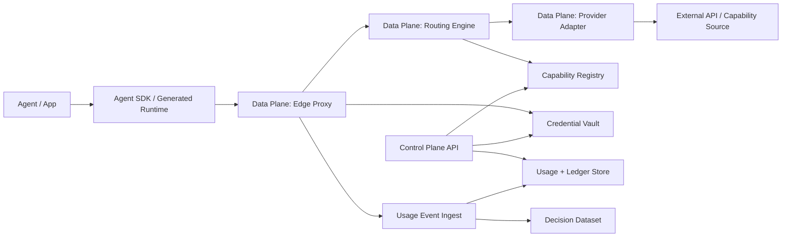

# Production Architecture RFC

状态：accepted architecture direction

日期：2026-05-30

相关文档：

- `docs/cn-ZH/MVP_EXIT_REVIEW.md`
- `docs/cn-ZH/ARCHITECTURE_DEFINITION_PHASE.md`
- `docs/cn-ZH/API2AGENT_PROTOCOL_V0_2.md`
- `schemas/api2agent/v0.2/protocol.schema.json`

## 1. 决策

API2Agent 将从 Python MVP 进入具备明确 Control Plane / Data Plane 分层的 production architecture。

技术方向：

- Data Plane：Go
- Control Plane backend：Go
- Local compiler 和 reference implementation：Python
- 未来 web dashboard：TypeScript

Hosted backend 两个 plane 都先选择 Go，原因是减少早期 runtime fragmentation，让 protocol types 更接近，并支持高并发 proxy workloads。

Python 仍然有价值，但只作为：

- local compiler
- reference implementation
- dogfood harness
- compatibility test surface

Python 不应该成为 hosted production data plane。

## 2. 产品边界

API2Agent 是：

```text
Agent capability execution and observability infrastructure
```

API2Agent 不是：

- Agent framework
- workflow engine
- marketplace UI
- payment system
- general script runtime

当前 production architecture 应优化：

- 最低 API/provider onboarding cost
- 真实 execution data ownership
- reliable proxy execution
- auditable routing
- credential-safe execution
- future economic measurement

## 3. 系统概览



## 4. Plane 拆分

### 4.1 Data Plane

Data Plane 执行调用。它必须快速、可靠、稳定。

职责：

- 接收 normalized execution requests
- 认证 project/API key
- 创建或接收 `RequestContext`
- 执行 routing policy
- 选择 provider 和 provider region
- 通过 vault interface 解析 credential reference
- 注入 provider credentials
- 执行 provider calls
- 处理 retry 和 failover
- 写入 usage events
- 写入 decision logs
- 返回 normalized results

Data Plane 非目标：

- provider onboarding UI
- billing and settlement
- marketplace search
- long-running analytics
- manual data correction

Data Plane 技术：

- language：Go
- HTTP server：标准 `net/http` 或薄 router
- serialization：JSON 优先，尽量从 protocol schema 生成
- storage access：append-only event writes 和 read-only routing snapshots

### 4.2 Control Plane

Control Plane 管理状态和配置。

职责：

- project identity
- API2Agent access API keys
- capability registry
- provider registry
- provider onboarding workflow
- credential vault metadata
- pricing and SLA metadata
- routing policy configuration
- quota configuration
- usage and ledger reporting
- decision dataset export

Control Plane 非目标：

- hot-path provider execution
- low-latency retry loops
- provider credential exposure
- workflow orchestration

Control Plane 技术：

- backend language：Go
- database：Postgres
- secrets：KMS-backed secret manager 或 managed vault
- analytics export：先 object storage，之后再 warehouse
- dashboard：未来 TypeScript app

### 4.3 Snapshot Distribution

Routing 和 credential policy 必须通过 versioned snapshots 分发。

最小 snapshot metadata：

- `snapshot_version`
- `snapshot_fetched_at`
- `snapshot_ttl`
- `snapshot_source`

稳定 `snapshot_source` 值：

- `push`
- `pull`

规则：

- Data Plane 必须在 routing decisions 中记录 `snapshot_version`。
- Control Plane 可以 push snapshots，也可以让 Data Plane pull snapshots。
- 如果 routing decision 没有 snapshot reference，就不足以支撑 production auditing。

## 5. 核心组件

### 5.1 Agent SDK / Generated Runtime

目标：

- 提供最低摩擦的 developer entry point
- 对 Agent builders 隐藏 proxy protocol details
- 支持 direct local mode 和 hosted proxy mode

Production requirement：

- SDK 应该是 thin clients。
- Business logic 属于 Data Plane 或 Control Plane。
- Python generated runtime 保留为 reference path，不是唯一 SDK target。

### 5.2 Edge Proxy

目标：

- 接收 Agent execution requests
- enforce project identity and quotas
- 绑定 request、routing、usage 和 decision records
- 保护 provider credentials

Edge runtime requirements：

- 将 total timeout budget 传递给 attempts
- 为 provider calls 保持 keepalive 和 connection reuse
- enforce per-attempt timeout policy

最小 endpoint：

```http
POST /v1/execute
Authorization: Bearer <api2agent_project_key>
Content-Type: application/json
```

Input 应映射到 `RequestContext` 和 execution parameters。

### 5.3 Routing Engine

目标：

- 根据 policy 和 observed metrics 选择 provider candidates
- 生成作为 pre-execution plan 的 `RoutingDecision`

Routing determinism：

- `routing_mode`：`deterministic` 或 `stochastic`
- `routing_seed`：用于可重现 selection 的可选稳定 seed

规则：

- 当使用相同 request context 和 snapshot version 时，deterministic routing 必须可以被 replay 和 audit 重现
- stochastic routing 可以用于 exploration，但必须记录 routing mode

初始 policies：

- `first`
- `lowest_cost`
- `lowest_latency`
- `region_aware_latency`
- `highest_success_rate`
- `balanced`

Routing 必须读取 immutable 或 versioned snapshots：

- capability definition
- provider candidate
- routing policy
- metrics window
- credential availability
- snapshot metadata

### 5.4 Provider Adapter Layer

目标：

- 把 protocol-level execution 转成 provider-specific HTTP/API calls
- 把 outputs normalize 到 capability output schema
- 把 provider errors 映射到 API2Agent error taxonomy

Adapter 规则：

- adapters 必须 versioned
- output mappings 必须 versioned
- adapters 默认应避免存储 raw request/response payloads
- adapters 必须输出足够安全的 metadata，用于 replay diagnostics

Adapter capabilities：

- `streaming`
- `idempotent`
- `timeout_control`
- `partial_failure`
- `region_routing`

### 5.5 Credential Vault

目标：

- 存储或引用 provider credentials
- 支持 BYOK 和未来 platform credentials
- 向 Data Plane 返回 injection patches，但不把 raw secrets 泄露到 logs

Credential scope 和 lifecycle：

- scope：project、user、session
- credential version 必须被追踪
- resolved timestamp 必须被记录

初始模型：

- project-owned credentials
- env/config credentials 只用于 local reference mode
- hosted credentials 通过 KMS-backed secret manager 存储
- usage events 只存 credential references

### 5.6 Usage、Ledger 和 Decision Dataset

目标：

- usage events 捕获 attempts
- ledger rows 聚合 measurement
- decision logs 生成未来 routing dataset

Event ordering：

- `event_sequence_id`
- `parent_attempt_id`

Cost and attribution：

- cost source 必须保持显式
- usage rows 应保留 cost 是 estimated、provider reported 还是 overridden

Protocol chain：

```text
RequestContext
  -> RoutingDecision
  -> UsageEvent
  -> DecisionLog
  -> LedgerRow
  -> DecisionDataset export
```

Storage policy：

- Postgres 是 operational metadata 的 system of record。
- usage 应优先使用 append-only event tables。
- Object storage 可保存 exports 和 benchmark artifacts。
- raw payload capture 默认关闭。

## 6. Data Model Ownership

System of record：

- Projects：Control Plane
- API2Agent API keys：Control Plane
- Capability definitions：Control Plane
- Provider candidates：Control Plane
- Credential metadata：Control Plane
- Secret material：Vault
- Request contexts：Data Plane writes，Control Plane reads
- Routing decisions：Data Plane writes，Control Plane reads
- Usage events：Data Plane writes，Control Plane reads
- Ledger rows：derived from usage
- Decision dataset：derived from routing decisions and usage events

## 7. Runtime Boundaries

### Python

保留：

- OpenAPI/curl compiler
- generated package reference
- MCP reference generation
- local dogfood
- protocol compatibility tests

不要扩展：

- hosted proxy
- high-throughput routing engine
- multi-tenant credential vault
- production usage pipeline

### Go

负责：

- hosted Edge Proxy
- Routing Engine
- Provider Adapter runtime
- Control Plane API
- protocol model generation
- operational stores

### TypeScript

后续负责：

- dashboard
- docs site interactive examples
- optional browser/client SDKs

## 8. Deployment Phases

### Phase A：RFC and Schema Lock

产物：

- Production Architecture RFC
- Protocol v0.2 schema snapshot
- migration plan from Python reference implementation

### Phase B：Go Data Plane Skeleton

产物：

- `/v1/execute`
- request context creation
- routing decision stub
- snapshot version propagation
- timeout budget propagation
- usage event append
- one provider adapter
- golden path integration test

### Phase C：Go Control Plane Minimum

产物：

- project model
- API2Agent API key model
- capability registry
- provider registry
- credential metadata
- routing policy snapshots
- snapshot distribution metadata
- protocol versioning policy

### Phase D：Dual-Run Dogfood

产物：

- Python MVP 和 Go Data Plane 执行同一个 dogfood capability
- usage events 可以干净对齐 v0.2 schema
- replay metadata 保持兼容
- deterministic replay 可以由 request context 和 snapshot version 重现

### Phase E：Hosted Alpha

产物：

- one hosted proxy region
- project credentials
- usage dashboard API
- quota enforcement
- 3 到 5 个真实 API dogfood providers

## 9. 非目标

Architecture phase 不做：

- marketplace UI
- billing and settlement
- public provider onboarding portal
- workflow execution engine
- non-API source runtimes
- multi-region active-active deployment
- complex stream processing stack

## 10. 关键风险

### Risk：Protocol and Implementation Drift

缓解：

- 尽可能从 schema 生成 Go structs
- 保留 Python compatibility tests
- emitted events 根据 schema snapshots 校验

### Risk：Data Plane 变得过重

缓解：

- Data Plane 执行 policy snapshots
- Control Plane 负责 policy authoring
- analytics 不进入 hot path

### Risk：Snapshot Drift

缓解：

- 在 routing decisions 中记录 `snapshot_version`
- 记录 fetch time 和 TTL
- 当 snapshot 超过 policy 时 fail closed

### Risk：Credential Leakage

缓解：

- vault 返回 short-lived injection material
- logs 和 usage events 只存 references
- replay 需要重新 resolve credential

### Risk：Routing Metrics 不可信

缓解：

- aggregate metrics 必须包含 metrics windows
- decision logs 分开保存 estimates 和 outcomes
- replay events 默认不进入 routing metrics

## 11. v0.3 Architecture Inputs

RFC 有意把这些留到 v0.3：

- concurrency and race semantics
- data governance and privacy classification
- capability canonicalization
- delegated credential flows
- side-effect levels
- standardized version formats
- retryable error semantics
- protocol governance policy
- snapshot distribution policy
- event ordering semantics

这些不是第一个 production architecture build 的前置条件，但在长期 external standard claim 前必须解决。

## 12. 接受标准

本 RFC 在以下条件满足时接受：

- Control Plane 和 Data Plane responsibilities 明确
- long-term backend runtime choices 已文档化
- Python reference role 已文档化
- core storage ownership 已文档化
- deployment phases 已文档化
- non-goals 明确
