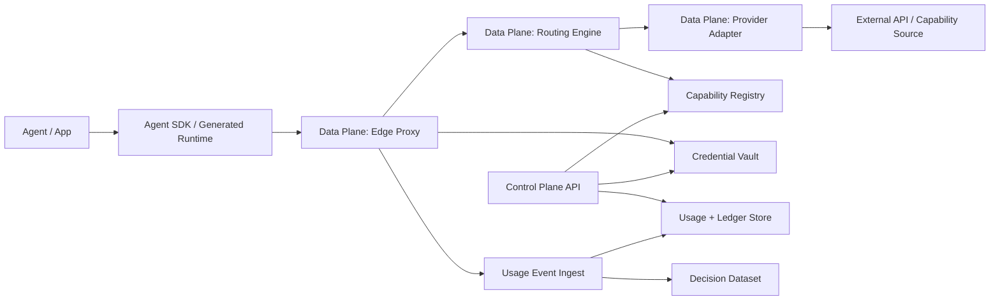

# Production Architecture RFC

Status: accepted architecture direction

Date: 2026-05-30

Related documents:

- `docs/en-US/MVP_EXIT_REVIEW.md`
- `docs/en-US/ARCHITECTURE_DEFINITION_PHASE.md`
- `docs/en-US/API2AGENT_PROTOCOL_V0_2.md`
- `schemas/api2agent/v0.2/protocol.schema.json`

## 1. Decision

API2Agent will move from a Python MVP into a production architecture with a clear Control Plane / Data Plane split.

Technology direction:

- Data Plane: Go
- Control Plane backend: Go
- Local compiler and reference implementation: Python
- Future web dashboard: TypeScript

Go is selected for both hosted backend planes to reduce early runtime fragmentation, keep protocol types close, and support high-concurrency proxy workloads.

Python remains valuable, but only as:

- local compiler
- reference implementation
- dogfood harness
- compatibility test surface

Python should not become the hosted production data plane.

## 2. Product Boundary

API2Agent is:

```text
Agent capability execution and observability infrastructure
```

API2Agent is not:

- an Agent framework
- a workflow engine
- a marketplace UI
- a payment system
- a general script runtime

Current production architecture should optimize for:

- lowest API/provider onboarding cost
- real execution data ownership
- reliable proxy execution
- auditable routing
- credential-safe execution
- future economic measurement

## 3. System Overview



## 4. Plane Split

### 4.1 Data Plane

The Data Plane executes calls. It must be fast, reliable, and boring.

Responsibilities:

- accept normalized execution requests
- authenticate project/API key
- create or accept `RequestContext`
- evaluate routing policy
- select provider and provider region
- resolve credential reference through the vault interface
- inject provider credentials
- execute provider calls
- handle retry and failover
- emit usage events
- emit decision logs
- return normalized results

Data Plane non-goals:

- provider onboarding UI
- billing and settlement
- marketplace search
- long-running analytics
- manual data correction

Data Plane technology:

- language: Go
- HTTP server: standard `net/http` or a thin router
- serialization: JSON first, generated from protocol schema where possible
- storage access: append-only event writes and read-only routing snapshots

### 4.2 Control Plane

The Control Plane manages state and configuration.

Responsibilities:

- project identity
- API keys for API2Agent access
- capability registry
- provider registry
- provider onboarding workflow
- credential vault metadata
- pricing and SLA metadata
- routing policy configuration
- quota configuration
- usage and ledger reporting
- decision dataset export

Control Plane non-goals:

- hot-path provider execution
- low-latency retry loops
- provider credential exposure
- workflow orchestration

Control Plane technology:

- backend language: Go
- database: Postgres
- secrets: KMS-backed secret manager or managed vault
- analytics export: object storage first, warehouse later
- dashboard: future TypeScript app

## 5. Core Components

### 5.1 Agent SDK / Generated Runtime

Purpose:

- provide the lowest-friction developer entry point
- hide proxy protocol details from Agent builders
- support direct local mode and hosted proxy mode

Production requirement:

- SDKs should be thin clients.
- Business logic belongs in Data Plane or Control Plane.
- Python generated runtime remains a reference path, not the only SDK target.

### 5.2 Edge Proxy

Purpose:

- receive Agent execution requests
- enforce project identity and quotas
- bind request, routing, usage, and decision records
- protect provider credentials

Minimum endpoint:

```http
POST /v1/execute
Authorization: Bearer <api2agent_project_key>
Content-Type: application/json
```

Input should map to `RequestContext` plus execution parameters.

### 5.3 Routing Engine

Purpose:

- choose provider candidates based on policy and observed metrics
- produce `RoutingDecision` as a pre-execution plan

Initial policies:

- `first`
- `lowest_cost`
- `lowest_latency`
- `region_aware_latency`
- `highest_success_rate`
- `balanced`

Routing must read from immutable or versioned snapshots:

- capability definition
- provider candidate
- routing policy
- metrics window
- credential availability

### 5.4 Provider Adapter Layer

Purpose:

- turn protocol-level execution into provider-specific HTTP/API calls
- normalize outputs into capability output schema
- map provider errors to API2Agent error taxonomy

Adapter rules:

- adapters must be versioned
- output mappings must be versioned
- adapters should avoid storing raw request/response payloads by default
- adapters must emit enough safe metadata for replay diagnostics

### 5.5 Credential Vault

Purpose:

- store or reference provider credentials
- support BYOK and future platform credentials
- return injection patches to Data Plane without leaking raw secrets to logs

Initial model:

- project-owned credentials
- env/config credentials only in local reference mode
- hosted credentials stored through a KMS-backed secret manager
- usage events store credential references only

### 5.6 Usage, Ledger, and Decision Dataset

Purpose:

- usage events capture attempts
- ledger rows aggregate measurement
- decision logs create the future routing dataset

Protocol chain:

```text
RequestContext
  -> RoutingDecision
  -> UsageEvent
  -> DecisionLog
  -> LedgerRow
  -> DecisionDataset export
```

Storage policy:

- Postgres is the system of record for operational metadata.
- Append-only event tables should be preferred for usage.
- Object storage can hold exports and benchmark artifacts.
- Raw payload capture is off by default.

## 6. Data Model Ownership

System of record:

- Projects: Control Plane
- API2Agent API keys: Control Plane
- Capability definitions: Control Plane
- Provider candidates: Control Plane
- Credential metadata: Control Plane
- Secret material: Vault
- Request contexts: Data Plane writes, Control Plane reads
- Routing decisions: Data Plane writes, Control Plane reads
- Usage events: Data Plane writes, Control Plane reads
- Ledger rows: derived from usage
- Decision dataset: derived from routing decisions and usage events

## 7. Runtime Boundaries

### Python

Keep:

- OpenAPI/curl compiler
- generated package reference
- MCP reference generation
- local dogfood
- protocol compatibility tests

Do not expand:

- hosted proxy
- high-throughput routing engine
- multi-tenant credential vault
- production usage pipeline

### Go

Own:

- hosted Edge Proxy
- Routing Engine
- Provider Adapter runtime
- Control Plane API
- protocol model generation
- operational stores

### TypeScript

Own later:

- dashboard
- docs site interactive examples
- optional browser/client SDKs

## 8. Deployment Phases

### Phase A: RFC and Schema Lock

Outputs:

- Production Architecture RFC
- Protocol v0.2 schema snapshot
- migration plan from Python reference implementation

### Phase B: Go Data Plane Skeleton

Outputs:

- `/v1/execute`
- request context creation
- routing decision stub
- usage event append
- one provider adapter
- golden path integration test

### Phase C: Go Control Plane Minimum

Outputs:

- project model
- API2Agent API key model
- capability registry
- provider registry
- credential metadata
- routing policy snapshots

### Phase D: Dual-Run Dogfood

Outputs:

- Python MVP and Go Data Plane execute same dogfood capability
- usage events compare cleanly against v0.2 schema
- replay metadata remains compatible

### Phase E: Hosted Alpha

Outputs:

- one hosted proxy region
- project credentials
- usage dashboard API
- quota enforcement
- 3 to 5 real API dogfood providers

## 9. Non-Goals

Do not build during this architecture phase:

- marketplace UI
- billing and settlement
- public provider onboarding portal
- workflow execution engine
- non-API source runtimes
- multi-region active-active deployment
- complex stream processing stack

## 10. Key Risks

### Risk: Protocol and Implementation Drift

Mitigation:

- generate Go structs from schema where possible
- keep Python compatibility tests
- validate emitted events against schema snapshots

### Risk: Data Plane Becomes Too Smart

Mitigation:

- Data Plane executes policy snapshots
- Control Plane owns policy authoring
- analytics stays outside the hot path

### Risk: Credential Leakage

Mitigation:

- vault returns short-lived injection material
- logs and usage events store references only
- replay requires credential re-resolution

### Risk: Routing Metrics Become Untrustworthy

Mitigation:

- all aggregate metrics include metrics windows
- decision logs preserve estimates and outcomes separately
- replay events are excluded from default routing metrics

## 11. v0.3 Architecture Inputs

The RFC intentionally leaves these for v0.3:

- concurrency and race semantics
- data governance and privacy classification
- capability canonicalization
- delegated credential flows
- side-effect levels
- standardized version formats
- retryable error semantics

These are not required before the first production architecture build, but they must be resolved before a long-term external standard claim.

## 12. Acceptance Criteria

This RFC is accepted when:

- Control Plane and Data Plane responsibilities are explicit
- long-term backend runtime choices are documented
- Python reference role is documented
- core storage ownership is documented
- deployment phases are documented
- non-goals are explicit
